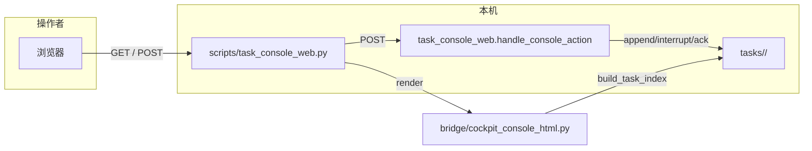

# Agent-Pilot 本地 Web Cockpit：详细进展与变更说明

**文档日期：** 2026-05-04（随实现演进可追加修订小节）  
**读者：** 仓库所有者、协作者、评审与集成方  
**范围：** 本地 HTTP 任务控制台（cockpit）的 **UI、交互、脚本入口与数据契约**；不包含飞书 Bot、Codex 执行器本体或 OMO/OMX 等编排框架。

**术语约定（重要）：** 文中 **「上一版本」** 仅指 **还没有完整 GUI 前端设计** 的时期：尚无 `GUI/` 下三栏 Cockpit 作为 **产品级视觉与信息架构契约**，观测与控制以 **`scripts/task_console.py`（终端）** 为主，Web 若有也多为 **极简工程页**。**不包括**「已写 `cockpit_console_html`、正在对齐 `GUI/code.html`」的过渡迭代——后者见 [§2.3](#23-过渡版与上一版本的分界)。

---

## 0. 阅读指南：本文解决什么问题

| 你可能想问 | 跳到 |
|------------|------|
| 「上一版本」到底指哪一阶段？与「有设计稿后的过渡版」有何不同？ | [§2](#2-上一版本指什么) · [§2.3](#23-过渡版与上一版本的分界) · [§3](#3-相对上一版本的主要变更) |
| 产品架构里 cockpit 占哪一层？ | [§1.1 架构边界](#11-架构边界与职责) |
| GET/POST 具体字段、重定向行为？ | [§4 HTTP 与表单契约](#4-http-与表单契约) |
| 示例任务 `demo-local-smoke` 写了哪些文件？ | [§5 演示数据与目录](#5-演示数据与目录布局) |
| 想本地跑起来给别人看 | [§6 演示与排障](#6-演示与排障) |
| 改 UI 该动哪些文件、有哪些测试？ | [§7 代码地图与回归](#7-代码地图与回归) |
| 仍依赖什么外部资源、有什么风险？ | [§8 已知限制与后续](#8-已知限制与后续工作) |

---

## 1. 当前进展

### 1.1 架构边界与职责

与 `AGENTS.md` 一致：

- **Python Bridge** 负责任务目录、`status.json` / `artifacts.json`、`control.jsonl`、外部进程调用等。
- **Codex + superpowers** 负责规划与执行；cockpit **不**替代其编排。
- **本地 Web cockpit** 是 **运维/观测面**：读 `tasks/` 与 `events/`（索引层），通过表单写入 **控制指令**（append / interrupt / ack / retry），**不**作为「创建任务」的主入口（创建仍来自 IM 或 `run_golembot_office_task` 等脚本）。



### 1.2 一句话进展

相对 **尚无完整 GUI 前端设计** 的时期：观测面从 **终端列表为主** 演进为浏览器内 **三栏 Cockpit**；相对 **`GUI/code.html` 定稿**：服务端渲染页在 **布局、字体、侧栏/顶栏/主栏/Inspector 信息层级** 上与稿对齐，并在不破坏任务协议的前提下保留 **追加指令、打断、确认、重试**；统计类文案放入 **`sr-only`**，避免挡设计视觉。

---

## 2. 上一版本指什么

**分界：** 以仓库 **`GUI/`** 目录下的 **完整三栏 Agent-Pilot Cockpit 前端设计**（静态参照 `GUI/code.html`、`GUI/DESIGN.md`、预览图等）为「有完整 GUI 前端设计」的起点。  
**上一版本** = **该设计尚未成为实现目标** 的阶段（不必绑定某一 commit，以能力/形态描述为准）。

### 2.1 上一版本在能力 / 形态上的典型特征

1. **观测入口**
   - 以 **`scripts/task_console.py`**（`--plain` 等）**终端表格**为主流操作方式；适合脚本化、SSH、CI 日志场景。
   - 若已有早期 Web 页，多为 **极简工程页**：单列表或简单表单，**无** 与现稿一致的三栏（侧栏会话 / 中间对话式进度 / 右侧 Inspector）、**无** 与 `GUI/code.html` 一致的 **Tailwind 设计 token + Material Symbols** 组件化布局。

2. **信息架构**
   - **无**「按会话分组任务」「中间气泡 + checklist + 工件卡片区」「右侧 Metadata & Artifacts + 执行详情四行」等产品化信息结构。
   - 任务元数据（thread、turn、控制队列等）通常以 **纯文本行** 或 **单页堆叠** 展示，而非当前「前四行对齐稿 + 运维折叠」的层级。

3. **设计资产**
   - **`GUI/`** 要么不存在，要么未作为 **实现与验收的单一视觉锚点**；协作者难以用「同一套 HTML 参照」对齐浏览器里的 cockpit。

4. **与飞书 / Bridge 的关系（不变）**
   - 上一版本与当前版本在 **架构边界** 上一致：任务真相仍在 `tasks/<task_id>/status.json` 等；cockpit **不**替代 Codex 编排。变化集中在 **人机观测与操作壳层**。

### 2.2 当前版本相对上一版本多了什么（宏观）

| 维度 | 上一版本（无完整 GUI 设计） | 当前 |
|------|------------------------------|------|
| 主入口形态 | 终端 `task_console.py` 为主 | 浏览器 **`task_console_web.py`** 三栏 cockpit 为推荐演示与运维面 |
| 视觉体系 | 无与稿一致的 token / 组件布局 | **`GUI/code.html` 同系** Tailwind + Material + Inter |
| 会话与任务 | 无侧栏「按会话分组」驾驶舱 | **`task-bindings.json` + session_key** 驱动的分组与选中态 |
| 操作 | 终端子命令 append / interrupt 等 | **同一页 POST** append / interrupt / ack / retry（协议仍写 `control.jsonl` 等） |
| 设计协作 | 难对齐单一像素目标 | 静态 **`GUI/code.html`** + 服务端 **`cockpit_console_html.py`** 双线可对照 |

### 2.3 过渡版与上一版本的分界

仓库在 **已有 `GUI/` 设计稿** 之后落地 cockpit 时，中间往往还有一段 **过渡工程态**：**已经引入** `bridge/cockpit_console_html.py` 与 Tailwind 三栏，但 **尚未**严格按 `GUI/code.html` 收敛（例如侧栏黄条提示 CDN、`body` 内联字体覆盖 Inter、右侧 Tab 与稿不一致等）。

| 说法 | 含义 |
|------|------|
| **上一版本**（本文 **§2**） | **尚无完整 GUI 前端设计** → 无三栏产品稿作契约、终端为主 |
| **过渡版**（本小节） | **已有 cockpit + 设计目标**，仍在 **对齐稿 / 去工程味** 的迭代 |

因此：**§3.1** 的表格是写给 **过渡版 → 当前** 的 UI 收尾（便于实现者对照 `code.html`）；**§3.0** 概括 **从「无完整 GUI」→ 当前** 的整条能力跨度。读文档时请先确认讨论的是 **「相对无 GUI」** 还是 **「相对过渡版」**，避免 PR 评论里各说各话。

---

## 3. 相对上一版本的主要变更

### 3.0 从「无完整 GUI」到「当前」的总览

1. **新增** 以 `GUI/` 为锚的 **产品化三栏布局** 与静态参照 `GUI/code.html`。  
2. **新增** `bridge/cockpit_console_html.py` 作为 **唯一大块 HTML** 的渲染实现，由 `bridge/task_console_web.render_console_html` 调用。  
3. **保留并集中到 Web** 原先需在终端完成的 **部分控制动作**（append / interrupt / ack / retry），与 `handle_console_action` 一致。  
4. **补充** `--ensure-demo`、`--ipv4-only`、`--open`、仓库根相对路径等 **本地演示与可运维性**（见 §5、§6）。

### 3.1 相对「GUI 对齐前」的界面收尾（过渡工程态 → 当前）

下列为 **已存在 cockpit、但尚未与 `GUI/code.html` 严格一致** 时常见的工程态，与 **§2 的「上一版本」** 不是同一概念；列的是 **对齐稿与收敛实现** 时做过的事：

| 区域 | GUI 对齐前（过渡工程态） | 当前实现要点 |
|------|---------------------------|----------------|
| **`<head>`** | `lang="zh-CN"`、Material 字体 URL 与稿略有差异 | 与稿对齐：`lang="en"`、`viewport` 写法、`Material+Symbols+Outlined:wght,FILL@100..700`、`tailwind.config` 的 `fontFamily.sans` 与稿一致 |
| **全局字体** | `body` 等内联 `system-ui` 覆盖 Inter | **移除**破坏性内联；依赖 Tailwind 的 `font-sans` → Inter |
| **侧栏** | 黄条 + 可见统计 + 脚注 | **移除**；结构对齐稿：`px-5 mb-5` 内放 logo 文案 + 搜索；其下为「新建任务」等操作、会话分组、`mt-auto` 页脚链接 |
| **顶栏** | 长 `task_id`、双状态徽标 | **标题**：优先任务 **摘要首行**（截断），无摘要时退回截断的 `task_id`；**徽标**：仅 **英文状态** 灰底（`ACTIVE` / `DONE` 等） |
| **主栏中部** | 偏技术说明的引导句 | 与稿语气接近的 **固定引导句** + checklist + **双列** 工件卡片网格（`grid-cols-2`） |
| **主栏底部输入** | `textarea` 行数、`resize`、占位符与稿不一致 | `rows="1"`、`resize-none`、占位符 `添加指令...`；`pb-32` / `pt-4 pb-6` 与稿一致 |
| **右侧** | Radio 切换或单栏混杂 | **Tab 条为视觉条**（与稿同款三格）；**单滚动区**：执行详情（含打断/确认/重试）→ 工件 → 时间线；运维字段进 **`<details>`** |
| **执行详情前四行** | 多行平铺技术字段 | **状态**（运行中「进行中」+ 脉动点）、**来源**、**创建于**、**任务 ID**（mono 灰底） |
| **`GUI/code.html`** | 易被当成产品页 | 头注释标明须用 **`task_console_web`** 联调；本文件为静态参照 |

### 3.2 功能：保留、微调与未承诺范围

**明确保留（与任务协议一致）**

- `GET /` 支持 `?task=<task_id>` 预选任务、`?q=` 子串过滤（在 `task_id`、`session_key`、`summary`、`codex_thread_id`、`state` 等拼接字段中搜索，逻辑见 `bridge/cockpit_console_html._filter_tasks`）。
- `POST`：`append`（需 `text`）、`interrupt`、`ack`（可选 `note`）、`retry`（可选 `generator`、`publish`）。
- 表单中普遍带 **`redirect_task`**，POST 后回到同一任务视图，避免「提交后跳到列表第一项」类体验问题。
- Flash 消息区（操作成功后的绿色提示条）。
- 右侧 **时间线**：读取 `control.jsonl` 尾部若干行 + `events` 目录下最近文件名的索引说明（非实时 WebSocket）。

**微调（实现细节，不改变协议）**

- 追加指令输入从单行 `input` 改为 **`textarea`**，与稿一致且支持多行追加；服务端仍只取 **`name="text"`** 最后一项（`parse_qs` 行为与 `bridge/task_console_web.handle_console_action` 一致）。

**不在 cockpit 内承诺的能力**

- **新建任务**：侧栏按钮打开 **`<dialog>`** 说明如何通过飞书或 CLI 创建任务；**不在此页 POST 创建目录**。
- **插件 / 帮助 / 设置**：当前多为 **`href="#"` + `title`**，占位；可按产品需要再接文档或环境变量 URL。

---

## 4. HTTP 与表单契约

### 4.1 GET 查询参数

| 参数 | 含义 | 备注 |
|------|------|------|
| `task` | 要选中的 `task_id` | 若不存在或不在过滤结果中，选择逻辑见 `_pick_selected`（过滤列表内匹配，否则列表首条） |
| `q` | 搜索过滤 | 空则显示全部；有任务但过滤为空时中间栏会提示「无匹配任务」 |

### 4.2 POST 表单（`application/x-www-form-urlencoded`）

所有动作均需 **`task_id`**（隐藏字段）。建议同时带 **`redirect_task`**（通常等于当前 `task_id`），以便处理函数重定向回带 `?task=` 的 URL（实现见 `scripts/task_console_web.py` 内 handler）。

| `action` | 必填字段 | 可选字段 | 后端行为（摘要） |
|----------|----------|----------|------------------|
| `append` | `text` | — | `append_control_command(..., "append_instruction", {"text": ...})` |
| `interrupt` | — | — | `append_control_command(..., "interrupt", {})` |
| `ack` | — | `note` | `ack_task(..., note=...)` |
| `retry` | — | `generator`（默认 `local`）、`publish`（checkbox `1`） | `retry_golembot_task(...)` |

错误处理：缺字段或非法 `action` 时 `handle_console_action` 抛 `ValueError`；`scripts/task_console_web.py` 的 `POST` 将其捕获后写入 **flash**（形如 `error: ...`），**仍返回 HTTP 200** 与整页 HTML，便于在页面上直接看到失败原因而非裸 400。

### 4.3 与「任务完成判定」的关系

再次强调 **AGENTS.md**：任务是否完成以 **`tasks/<task_id>/status.json`** 与 **`artifacts.json`** 为准，**不以** cockpit 页面是否刷新、tmux 文本为准。Cockpit 只反映索引层读到的快照。

---

## 5. 演示数据与目录布局

### 5.1 `--ensure-demo` 行为（`bridge/console_demo_seed.py`）

- **常量**：`DEMO_TASK_ID = "demo-local-smoke"`。
- 若 `tasks/<DEMO_TASK_ID>/status.json` **已存在**，则 **不写盘**，直接返回。
- 若不存在：
  - 调用 `create_task` 写入 `request.md` 等；`request` 正文优先来自 **`examples/demo_request.md`**，否则使用内置占位 Markdown。
  - 写入示例 `document.md`，并 `write_artifacts` / `write_status(..., "completed", None)`，使 cockpit 上有 **摘要、工件列表、完成态** 等可看内容。
  - 若 **`tasks/task-bindings.json`** 不存在，则写入一条 **演示用会话绑定**（会话名「答辩演示群」、`codex_thread_id` / `active_turn_id` 等），便于侧栏 **按会话分组** 与右侧 **来源** 列展示。

### 5.2 路径解析（避免「在 scripts 目录启动读不到 tasks」）

`scripts/task_console_web.py` 通过 `resolve_repo_relative_path` 将 **`--tasks-root`**、**`--event-dir`** 的相对路径 **固定解析到仓库根**，与当前工作目录无关。协作者在文档或 CI 中应 **显式写** 相对仓库根的路径（默认 `tasks`、`events`）。

---

## 6. 演示与排障

### 6.1 推荐一键演示（Windows / 企业网络友好）

在仓库根目录：

```bash
python scripts/task_console_web.py --ensure-demo --ipv4-only --open
```

- **`--ensure-demo`**：保证有 `demo-local-smoke` 与（必要时）绑定文件。  
- **`--ipv4-only`**：仅监听 `127.0.0.1`，规避部分环境下 `localhost` → `::1` 的连通问题。  
- **`--open`**：短暂延迟后尝试用系统默认浏览器打开 **示例任务 URL**。

终端会打印类似：

- `http://127.0.0.1:<port>/`  
- `示例任务页: http://127.0.0.1:<port>/?task=demo-local-smoke`

### 6.2 端口与环境变量

- 默认端口 **8765**，可被 **`IM_COLLAB_CONSOLE_PORT`** 覆盖；命令行 **`--port`** 优先级更高（见 `scripts/task_console_web.py`）。
- 监听 `0.0.0.0` 时可供局域网访问，注意安全边界（本地工具，非生产加固服务）。

### 6.3 常见问题（FAQ）

| 现象 | 可能原因 | 建议 |
|------|----------|------|
| 页面几乎无样式、布局塌缩 | **Tailwind CDN** 被公司代理或防火墙拦截 | 换网络或白名单 `cdn.tailwindcss.com` / `fonts.googleapis.com`；不要用 `GUI/code.html` 冒充联调 UI |
| `localhost` 连不上 | IPv6 / DNS / 浏览器差异 | 使用终端打印的 **`127.0.0.1`** |
| 列表为空 | `tasks/` 无有效 `status.json` 或路径错 | 使用 `--ensure-demo` 或检查 `--tasks-root` |
| POST 后看不到变化 | 未带 `redirect_task` 或缓存 | 确认表单隐藏字段；强刷或再看 `control.jsonl` |

### 6.4 请勿混淆的两种「预览」

| 方式 | 是否读 `tasks/` | 是否有 POST |
|------|-------------------|---------------|
| 浏览器直接打开 **`GUI/code.html`** | 否 | 否 |
| **`task_console_web.py` 起的 HTTP 服务** | 是 | 是 |

给仓库其他所有者演示时，请 **统一口径**：产品向演示用 **HTTP cockpit**；`GUI/code.html` 仅用于 **设计对齐与评审截图参照**（亦可对照 `GUI/cockpit-preview.png` 等资产）。

---

## 7. 代码地图与回归

### 7.1 主要模块职责

| 文件 | 职责 |
|------|------|
| **`bridge/cockpit_console_html.py`** | **唯一**大块 HTML 字符串拼装：`render_cockpit_document`、侧栏/主栏/右侧、`_append_form`、`_ops_form`、`_right_inspector_drawer`、`_build_inspector_primary_rows_html`、`_cockpit_header_title`、`_shell_head` 等。改 UI 首选此文件。 |
| **`bridge/task_console_web.py`** | `render_console_html`：组装索引 + 调用 `render_cockpit_document`；`handle_console_action`：四类动作与参数校验。 |
| **`scripts/task_console_web.py`** | `ThreadingHTTPServer`、`GET`/`POST` 解析、`flash` cookie/query、**IPv4-only / 双栈** 监听、`--open`、端口打印。 |
| **`bridge/task_index.py`** | `TaskSummary` / `EventSummary`、`build_task_index`、`summarize_events` — cockpit 展示字段的数据源。 |
| **`bridge/console_demo_seed.py`** | 本地示例任务与绑定种子。 |
| **`GUI/code.html`** | 静态设计参照；**非**运行时入口。 |

### 7.2 `cockpit_console_html.py` 内值得注意的函数（便于二次开发）

- **`render_cockpit_document`**：整页入口；处理无任务、无过滤结果、无选中任务、有选中任务等分支。
- **`_cockpit_header_title`**：主栏标题字符串（摘要优先）。
- **`_build_inspector_primary_rows_html`**：右侧前四行 + 运维 `<details>`。
- **`_right_inspector_drawer`**：右侧整体结构（tab 装饰条 + 三块内容区）。
- **`_append_form` / `_ops_form`**：底部输入与右侧控制按钮组；字段名必须与 `handle_console_action` 一致。
- **`_shell_head`**：CDN、字体、Tailwind 配置；修改主题时与 `GUI/code.html` 保持同步可减少色差。

### 7.3 回归测试

- **`tests/test_task_console_web.py`**  
  - 渲染结果中包含任务 id、状态、`tailwindcss.com`、绑定里的 thread/turn、控制类型、`name="action" value="append|interrupt|ack|retry"` 等。  
  - `handle_console_action` 对 append / interrupt / ack 及 `control.jsonl` / `ack.json` 的副作用。  
- **`Agent-Pilot 办公助手`** 等文案现位于页面 **`sr-only`** 段，**勿删**，否则测试失败。

运行示例：

```bash
python -m pytest tests/test_task_console_web.py -q
```

---

## 8. 已知限制与后续工作

### 8.1 已知限制

1. **Tailwind 运行时 CDN**：无构建步骤，依赖浏览器拉取 `cdn.tailwindcss.com`；离线或强策略网络下样式会失效。若未来需要 **零外网**，需引入构建链（如 Tailwind CLI）或将关键 utility 编译进静态 CSS（工作量与 AGENTS「小步可测」权衡后决策）。
2. **无认证**：本地环回使用为主；**勿**将 `--host 0.0.0.0` 暴露在无防火墙的公网。
3. **侧栏链接**：帮助/设置等多为占位 `href="#"`，避免绑定到某一固定 GitHub org（fork 友好）。

### 8.2 建议的后续改进（非排期承诺）

- 将 **`docs/2026-05-04-cockpit-ui-progress.md`** 作为「cockpit 变更日志」母文档：每次大改 UI 追加 **「修订记录」** 小节（日期 + PR + 要点）。
- README 控制台小节已与「无侧栏黄条、无 body 内联覆盖」对齐；若再改 cockpit，请 **同步检查 README** 是否仍准确。
- 可选：通过环境变量注入 **帮助/设置** 的绝对 URL；可选：右侧 Tab 条与内容区做 **真实切换**（需少量 JS 或保留早期 radio 方案并统一视觉）。

---

## 9. 修订记录

| 日期 | 说明 |
|------|------|
| 2026-05-04 | 首版详细文档：契约、演示种子、代码地图、FAQ、修订记录表。 |
| 2026-05-04 | **术语**：明确「上一版本」= **尚无完整 GUI 前端设计**（终端/极简 Web）；**过渡版** = 已有 cockpit、对齐 `GUI/code.html` 前的工程态。修正阅读指南锚点。 |

---

*若你修改了 `bridge/cockpit_console_html.py` 或 `scripts/task_console_web.py` 的对外行为，请更新 **§4**、**§6** 或 **§9**，并在 PR 描述中 `@` 相关协作者。*
